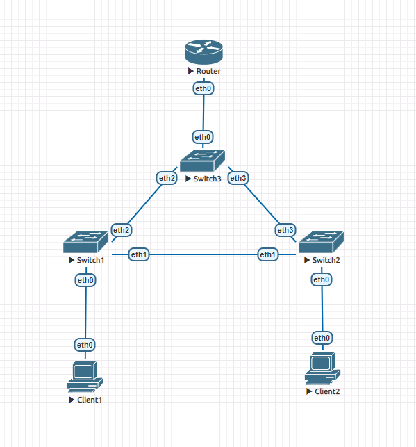

# Реализация небольшой сети офиса

Схема устройства сети:



## Client1
```
VPCS> show ip

NAME        : VPCS[1]
IP/MASK     : 10.0.10.1/24
GATEWAY     : 10.0.10.3
DNS         :
MAC         : 00:50:79:66:68:06
LPORT       : 20000
RHOST:PORT  : 127.0.0.1:30000
MTU         : 1500
```
```
VPCS> ping 10.0.20.1

84 bytes from 10.0.20.1 icmp_seq=1 ttl=63 time=5.695 ms
84 bytes from 10.0.20.1 icmp_seq=2 ttl=63 time=2.851 ms
84 bytes from 10.0.20.1 icmp_seq=3 ttl=63 time=2.862 ms
84 bytes from 10.0.20.1 icmp_seq=4 ttl=63 time=2.915 ms
84 bytes from 10.0.20.1 icmp_seq=5 ttl=63 time=3.104 ms
```

## Client2
```
VPCS> show ip

NAME        : VPCS[1]
IP/MASK     : 10.0.20.1/24
GATEWAY     : 10.0.20.3
DNS         :
MAC         : 00:50:79:66:68:07
LPORT       : 20000
RHOST:PORT  : 127.0.0.1:30000
MTU         : 1500
```
```
VPCS> ping 10.0.10.1

84 bytes from 10.0.10.1 icmp_seq=1 ttl=63 time=2.913 ms
84 bytes from 10.0.10.1 icmp_seq=2 ttl=63 time=3.575 ms
84 bytes from 10.0.10.1 icmp_seq=3 ttl=63 time=2.828 ms
84 bytes from 10.0.10.1 icmp_seq=4 ttl=63 time=2.939 ms
84 bytes from 10.0.10.1 icmp_seq=5 ttl=63 time=3.408 ms
```

## Switch1 interfaces
```
interfaces {
     bridge br0 {
         enable-vlan
         member {
             interface eth0 {
                 native-vlan 10
             }
             interface eth1 {
                 allowed-vlan 10
                 allowed-vlan 20
             }
             interface eth2 {
                 allowed-vlan 20
                 allowed-vlan 10
             }
         }
         priority 2
         stp
     }
     ethernet eth0 {
         hw-id 50:00:00:03:00:00
     }
     ethernet eth1 {
         hw-id 50:00:00:03:00:01
     }
     ethernet eth2 {
         hw-id 50:00:00:03:00:02
     }
     ethernet eth3 {
         hw-id 50:00:00:03:00:03
     }
     loopback lo {
     }
 }
```

## Switch2 interfaces
```
interfaces {
     bridge br0 {
         enable-vlan
         member {
             interface eth0 {
                 native-vlan 20
             }
             interface eth1 {
                 allowed-vlan 10
                 allowed-vlan 20
             }
             interface eth3 {
                 allowed-vlan 20
                 allowed-vlan 10
             }
         }
         priority 2
         stp
     }
     ethernet eth0 {
         hw-id 50:00:00:04:00:00
     }
     ethernet eth1 {
         hw-id 50:00:00:04:00:01
     }
     ethernet eth2 {
         hw-id 50:00:00:04:00:02
     }
     ethernet eth3 {
         hw-id 50:00:00:04:00:03
     }
     loopback lo {
     }
 }
```

## Switch3 interfaces
```
interfaces {
     bridge br0 {
         enable-vlan
         member {
             interface eth0 {
                 allowed-vlan 10
                 allowed-vlan 20
             }
             interface eth2 {
                 allowed-vlan 20
                 allowed-vlan 10
             }
             interface eth3 {
                 allowed-vlan 10
                 allowed-vlan 20
             }
         }
         priority 1
         stp
     }
     ethernet eth0 {
         hw-id 50:00:00:05:00:00
     }
     ethernet eth1 {
         hw-id 50:00:00:05:00:01
     }
     ethernet eth2 {
         hw-id 50:00:00:05:00:02
     }
     ethernet eth3 {
         hw-id 50:00:00:05:00:03
     }
     loopback lo {
     }
 }
```

## Router interfaces
```
interfaces {
     ethernet eth0 {
         hw-id 50:00:00:02:00:00
         vif 10 {
             address 10.0.10.3/24
         }
         vif 20 {
             address 10.0.20.3/24
         }
     }
     ethernet eth1 {
         hw-id 50:00:00:02:00:01
     }
     ethernet eth2 {
         hw-id 50:00:00:02:00:02
     }
     ethernet eth3 {
         hw-id 50:00:00:02:00:03
     }
     loopback lo {
     }
 }
```

Чтобы запросы не ходили по нижнему линку в обе стороны прописал stp в маршрутизаторах
и поставил корневому маршрутизатору меньший по значению преоритет, чтобы запросы
шли через него. Как результат, Switch2 > Switch1 заблокирован.
```
br0
 bridge id              0002.500000040000
 designated root        0001.500000050000
 root port                 3                    path cost                100
 max age                  20.00                 bridge max age            20.00
 hello time                2.00                 bridge hello time          2.00
 forward delay            14.00                 bridge forward delay      14.00
 ageing time             300.00
 hello timer               0.00                 tcn timer                  0.00
 topology change timer     0.00                 gc timer                 269.71
 flags

eth0 (1)
 port id                8001                    state                forwarding
 designated root        0001.500000050000       path cost                100
 designated bridge      0002.500000040000       message age timer          0.00
 designated port        8001                    forward delay timer        0.00
 designated cost         100                    hold timer                 0.00
 flags

eth1 (2)
 port id                8002                    state                  blocking
 designated root        0001.500000050000       path cost                100
 designated bridge      0002.500000030000       message age timer         19.09
 designated port        8002                    forward delay timer        0.00
 designated cost         100                    hold timer                 0.00
 flags

eth3 (3)
 port id                8003                    state                forwarding
 designated root        0001.500000050000       path cost                100
 designated bridge      0001.500000050000       message age timer         19.10
 designated port        8003                    forward delay timer        0.00
 designated cost           0                    hold timer                 0.00
 flags
```