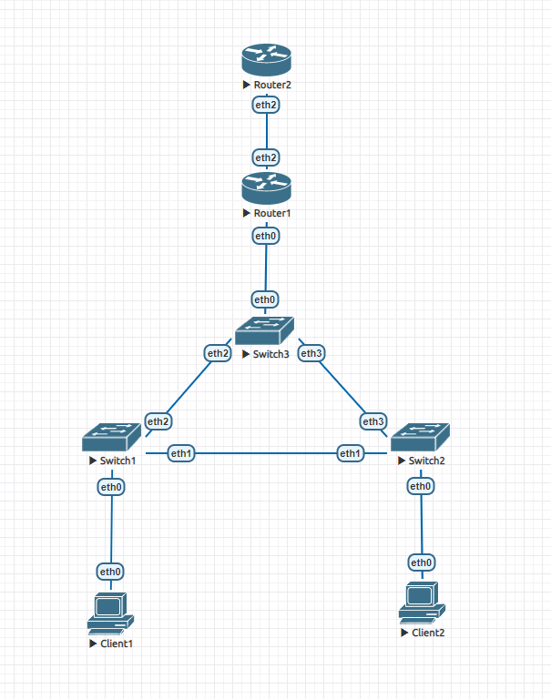

# Модернизация сети офиса из задания 1 (или же Exhibit, pimp my network)



## Client1

```
VPCS> ip dhcp
DDORA IP 10.0.10.10/24 GW 10.0.10.3
```

## Client2

```
VPCS> ip dhcp
DDORA IP 10.0.20.10/24 GW 10.0.20.3
```

## Client1

```
VPCS> ping 10.0.20.10

84 bytes from 10.0.20.10 icmp_seq=1 ttl=63 time=5.673 ms
84 bytes from 10.0.20.10 icmp_seq=2 ttl=63 time=2.886 ms
84 bytes from 10.0.20.10 icmp_seq=3 ttl=63 time=2.880 ms
84 bytes from 10.0.20.10 icmp_seq=4 ttl=63 time=2.826 ms
84 bytes from 10.0.20.10 icmp_seq=5 ttl=63 time=3.406 ms
```

## Client2

```
VPCS> ping 10.0.10.10

84 bytes from 10.0.10.10 icmp_seq=1 ttl=63 time=2.950 ms
84 bytes from 10.0.10.10 icmp_seq=2 ttl=63 time=2.982 ms
84 bytes from 10.0.10.10 icmp_seq=3 ttl=63 time=2.889 ms
84 bytes from 10.0.10.10 icmp_seq=4 ttl=63 time=2.924 ms
84 bytes from 10.0.10.10 icmp_seq=5 ttl=63 time=3.368 ms
```

## Client1

```
VPCS> ping 11.11.11.11

84 bytes from 11.11.11.11 icmp_seq=1 ttl=64 time=1.333 ms
84 bytes from 11.11.11.11 icmp_seq=2 ttl=64 time=1.491 ms
84 bytes from 11.11.11.11 icmp_seq=3 ttl=64 time=2.495 ms
84 bytes from 11.11.11.11 icmp_seq=4 ttl=64 time=1.648 ms
84 bytes from 11.11.11.11 icmp_seq=5 ttl=64 time=1.639 ms
```

## Client2

```
VPCS> ping 11.11.11.11

84 bytes from 11.11.11.11 icmp_seq=1 ttl=64 time=1.714 ms
84 bytes from 11.11.11.11 icmp_seq=2 ttl=64 time=1.847 ms
84 bytes from 11.11.11.11 icmp_seq=3 ttl=64 time=1.605 ms
84 bytes from 11.11.11.11 icmp_seq=4 ttl=64 time=1.630 ms
84 bytes from 11.11.11.11 icmp_seq=5 ttl=64 time=1.630 ms
```

На внешнем роутере я лишь поствил адрес 11.11.11.11/24. На внутреннем настроил NAT и DHCP.
```
interfaces {
     ethernet eth0 {
         hw-id 50:00:00:02:00:00
         vif 10 {
             address 10.0.10.3/24
         }
         vif 20 {
             address 10.0.20.3/24
         }
     }
     ethernet eth1 {
         address 11.11.11.11/24
         hw-id 50:00:00:02:00:01
     }
     ethernet eth2 {
         address 22.22.22.22/24
         hw-id 50:00:00:02:00:02
     }
     ethernet eth3 {
         hw-id 50:00:00:02:00:03
     }
     loopback lo {
     }
 }
 nat {
     source {
         rule 20 {
             outbound-interface eth2
             source {
             }
             translation {
                 address 22.22.22.22
             }
         }
     }
 }
 protocols {
     static {
         route 0.0.0.0/0 {
             next-hop 11.11.11.11 {
             }
         }
     }
 }
 service {
     dhcp-server {
         shared-network-name sub10 {
             subnet 10.0.10.0/24 {
                 default-router 10.0.10.3
                 name-server 10.0.10.3
                 range 0 {
                     start 10.0.10.10
                     stop 10.0.10.254
                 }
             }
         }
         shared-network-name sub20 {
             subnet 10.0.20.0/24 {
                 default-router 10.0.20.3
                 name-server 10.0.20.3
                 range 0 {
                     start 10.0.20.10
                     stop 10.0.20.254
                 }
             }
         }
     }
 }
 system {
     config-management {
         commit-revisions 100
     }
     conntrack {
         modules {
             ftp
             h323
             nfs
             pptp
             sip
             sqlnet
             tftp
         }
     }
     console {
         device ttyS0 {
             speed 115200
         }
     }
     host-name vyos
     login {
         user vyos {
             authentication {
                 encrypted-password $6$eIBbcqS2Py$BqUVYT.lGXiW40cOK7pUrV/8ioFz7n9iuC5SfEbS8MYXttGrCJGejtSF6BY3mpnJYfxJ808eoMQk0C..al5cS0
                 plaintext-password ""
             }
         }
     }
     ntp {
         server time1.vyos.net {
         }
         server time2.vyos.net {
         }
         server time3.vyos.net {
         }
     }
     syslog {
         global {
             facility all {
                 level info
             }
             facility protocols {
                 level debug
             }
         }
     }
 }
```
Свичи не трогал из дз1, поэтому не стал их добавлять в конфиги.
Добавляя конфиги заметил что остались записи адресов на неправильные интерфейсы в роутерах, я случайно, удалять уже поздно и лень если честно...

Fin.

